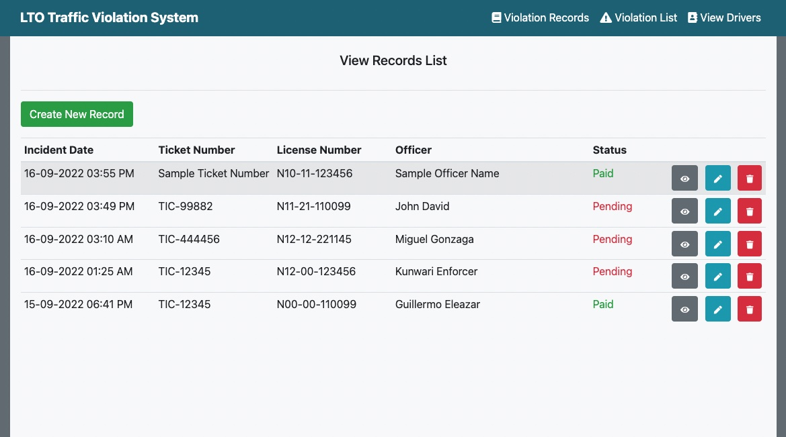

_Author: **Onalyn Go**_


# LTO Traffic Violation System

This is a simple project of **LTO Traffic Violation System**.

## Description

Hi! Welcome to the README file of my simple humble project called **LTO Traffic Violation System**.

This project is composed of the following features:

- list of traffic violations
- list of created drivers
- list of records of traffic violation
- list of pending records and paid records

> **Note:** That you may find it immediately on the dashboard.

## Getting Started

This is just an example of how to give instructions using README file.

### Sample Dependencies

- [Windows 11](https://www.microsoft.com/software-download/windows11)
- [MacOS](https://www.apple.com/ph/macos/monterey/)
 
### Installation

- You may just clone the repository to be able to install it locally.
- You may download also here in [Google](https://www.google.com) the other programs that needed to properly work it.

_sample installation code_
```code
cd folderName
code install
```

## Functionality of the program


This is the image of the dashboard of the project. As you can see, there's a summary of each functionality of the program, such as:

- Today's Record of Traffic Violations
- Total Driver's Listed
- Total Traffic Violations
- Today's New Driver Listed
- Total Pending Record
- Total Paid Record


In here, you can view the list of all the created drivers. For each item, you can edit, view each details, and delete. You can also **Add New Driver**.



In here, you can view the list of all the records of violations or offense. For each item, you can edit, view each details, and delete. You can also **Create New Record**.


In here, you can view the list of all the violations created. For each item, you can edit, view each details, and delete. You can also **Create New Violation**.

## Future Improvement

> There's a lot to improve here.